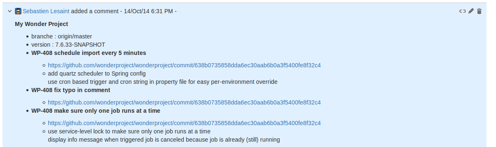

# JIRAc: comment helper

> // It's about comments, stupid!

## Goal

Automate JIRA comment creation from Git commits for a Maven project.

This command line tool will generate a formatted comment for JIRA right into your clipboard that you can then paste into a JIRA comment and get a result such as the following:



## Downloads

### Latest

git clone ;-)

## Installation

### Linux

1. install Git and other dependencies

    ```sh
    sudo apt-get update
    sudo apt-get install git xmlstarlet xclip
    ```

2. clone the repo on your disk, for example in your home directory

    ```sh
    git clone https://github.com/jirac/jirac.git ~/jirac
    ```

3. add `jirac` directory to your `PATH`, for example by adding a line to your `.bashrc`

    ```sh
    echo "export PATH=~/jirac:$PATH" >> ~/.bashrc
    ```

4. make sure the environement variable `VISUAL` or `EDITOR` is set.

    ```sh
    # test with the following command
    echo "if this [$VISUAL$EDITOR] is empty, you must set either property VISUAL or EDITOR"
    # add vim as your editor in your .bashrc with the following command
    echo "export EDITOR=vim" >> ~/.bashrc
    ```

5. you are done

### Windows

1. install [Git Bash](http://msysgit.github.io/)
2. install [mktemp](http://gnuwin32.sourceforge.net/packages/mktemp.htm) and include its `bin` folder in `PATH`
3. install [XMLStarlet](http://xmlstar.sourceforge.net/download.php)
4. clone this repo ;) and include the clone directory in `PATH`
5. define environment variable `VISUAL` or `EDITOR` (e.g.: "vim")
6. done

### Mac users

1. brew tap the `jirac` repository

    ```sh
    brew tap jirac/jirac
    ```

2. install `jirac` formula

    ```sh
    brew install --HEAD jirac
    ```

3. upgrade `jirac` to latest version

    ```sh
    brew reinstall --HEAD jirac
    ```

### Quick note on editor export

If you plan to export a graphical editor (such as gedit, Sublime Text etc), you should already know you **HAVE TO** specify specific options ("-w -s" for gedit, "-n -w" for Sublime) in the editor export so that it **BLOCKS** the calling script.

Obviously regardless of the editor you use, **escape spaces in its path before exporting it**!

## Execution

`jirac` must be executed from the root directory of a Maven project version controlled with Git. Otherwise an informative message will be displayed.

After selecting one or more commits, either interactively or with command line arguments, `jirac` will generate a formatted text for JIRA 
with the following information and copy it to your clipboard:
* name of the projet
* current branch
* current version
[for each selected commit]
* commit subject
    * link the commit in the GIT graphical interface of the project (if any)
    * content

## Why `jirac` only shows pushed commits

`jirac` generates a link to the GIT graphical interface of the project (if any).

Such URL is based on the id of the commit which can not be assumed to be definitive unless the commit has been pushed and shared with other.

Therefore, to remain on the safe side, `jirac` enforces *pushed* commit selection.

## Detailed documentation

See [the jirac online guide](http://ihommani.gitbooks.io/jirac-guide).

## Troubleshooting

:fearful:

Create a [Github issue](https://github.com/jirac/jirac/issues) if needed with as much as details as you can.
